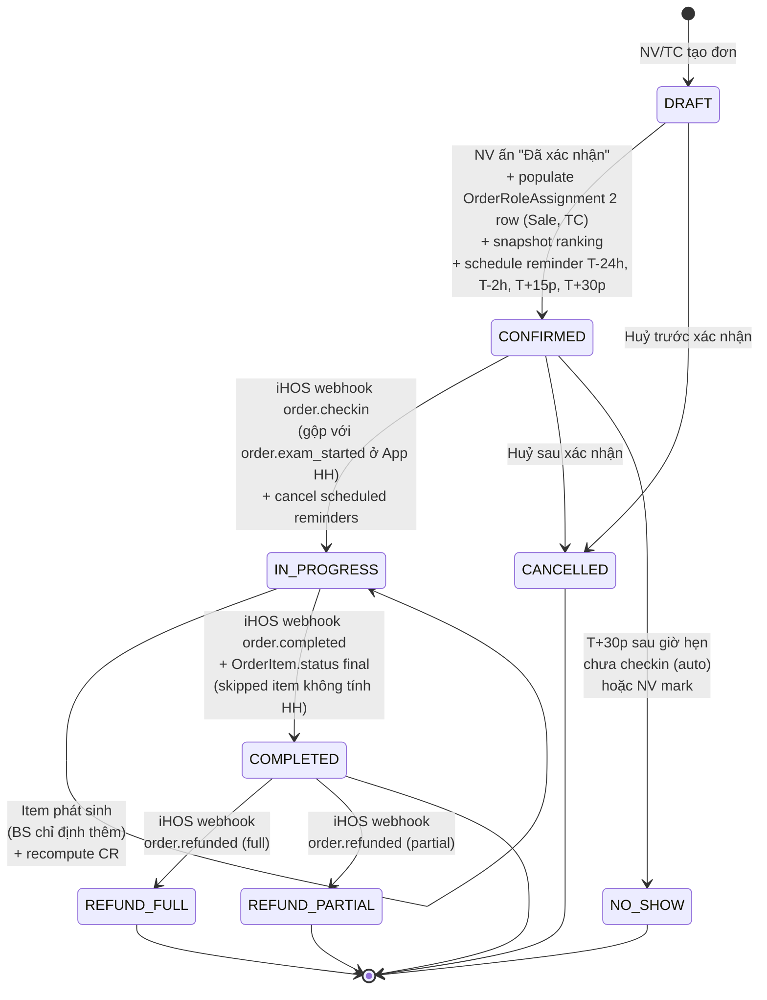
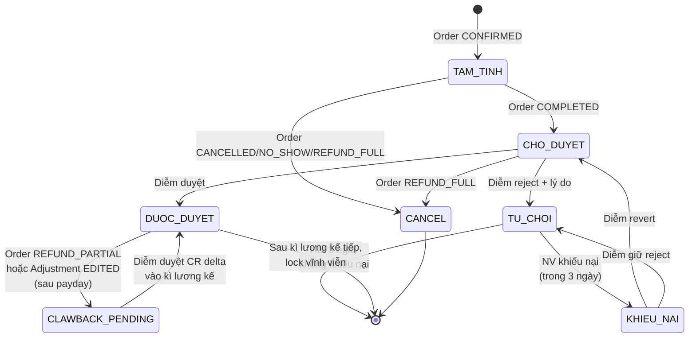
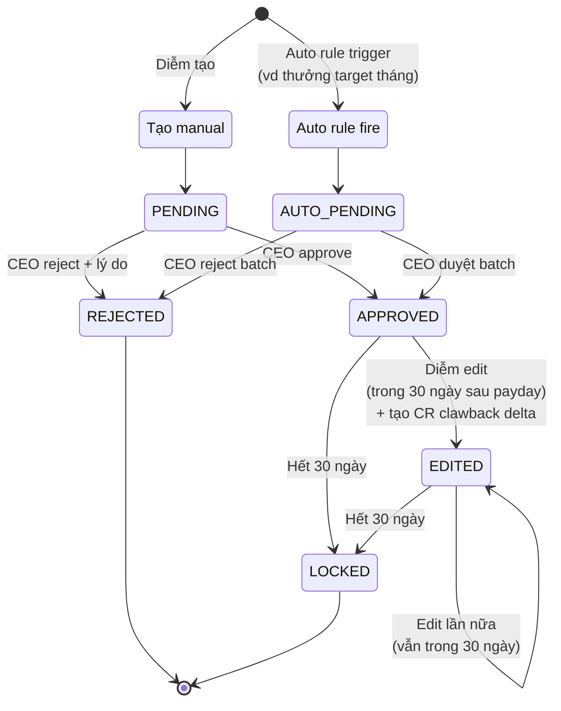

# B2.2 BPMN Flowchart và State Machine

Status: WIP draft 1
Ngày: 2026-04-25
Phụ thuộc: B1 FINAL vòng 11, B2.1 personas, ADR-001 shift architecture J, PENDING-ITEMS.md

Mục đích: Visualize lifecycle các entity chính (Order, CommissionRecord, AdjustmentRequest) và end-to-end BPMN từ lead đến chi lương. Dùng Mermaid để render. Kèm narrative đọc không cần render.

Convention:
- State (hình chữ nhật bo tròn): trạng thái entity
- Transition (mũi tên + label): event/action chuyển state
- Decision (hình thoi): điểm rẽ nhánh
- Actor (annotation): ai trigger transition

---

## 1. State Machine: Order Lifecycle

### 1.1 States

**Note (update v2 25/04/2026)**: State machine simplify từ 9 states còn 8 states. Gộp CHECKED_IN + IN_EXAM thành IN_PROGRESS (App HH không cần granular tracking giữa 2 state này, iHOS vẫn track riêng).

| State | Mô tả | Trigger vào state |
|---|---|---|
| DRAFT | Đơn mới tạo, chưa xác nhận | NV/TC tạo đơn (iHOS hoặc app HH) |
| CONFIRMED | Đã xác nhận, OrderRoleAssignment populated, snapshot ranking | NV ấn "Đã xác nhận" |
| IN_PROGRESS | Khách đã đến clinic, đang trong quá trình khám | iHOS webhook `order.checkin` (App HH gộp với `order.exam_started`). Cả 2 sub-state cùng track như nhau ở App HH. |
| COMPLETED | Hoàn thành toàn bộ dịch vụ (kể cả khi khách bỏ về giữa chừng, item dở dang mark `skipped`) | iHOS webhook `order.completed` |
| CANCELLED | Huỷ trước khám | NV/TC mark cancel hoặc iHOS webhook `order.cancelled` |
| NO_SHOW | Khách không đến | T+30p sau giờ hẹn chưa checkin (auto) hoặc NV mark thủ công |
| REFUND_FULL | Refund toàn phần sau COMPLETED | iHOS webhook `order.refunded` (full) |
| REFUND_PARTIAL | Refund 1 phần sau COMPLETED | iHOS webhook `order.refunded` (partial) |

OrderItem có field bổ sung:
- `status`: planned / completed / skipped
- `skipped_reason` (nullable): customer_left / insurance_rejected / other

OrderItem `status = skipped` không tính HH. Item này phát sinh khi khách bỏ về giữa khám (đã làm A, dở B, chưa làm C → A=completed, B=skipped, C=skipped).

### 1.2 Mermaid diagram



### 1.3 Narrative

Đơn đi từ DRAFT khi NV/TC tạo. Đến khi NV ấn "Đã xác nhận" thì system:
- Populate `OrderRoleAssignment` 2 row (Sale, TC theo lookup ShiftHeadAssignment). KT và CEO KHÔNG có row vì không ăn HH per đơn (chốt vòng 13).
- Snapshot ranking của user vào `ranking_snapshot_id`
- Schedule 4 reminder vào NotificationLog (T-24h, T-2h, T+15p NV gọi, T+30p auto NO_SHOW)
- Lock assignee (không reassign trừ trường hợp handover)

Row BS được thêm sau, khi `order.exam_started` fire kèm doctor_id (mỗi BS 1 row, per-doctor không phụ thuộc số dịch vụ). Row BS đã add thì giữ, item skipped sau đó không xoá row.

Từ CONFIRMED có 3 nhánh:
- Khách đến clinic → iHOS sync `order.checkin` (hoặc `order.exam_started`) → IN_PROGRESS. Cancel pending reminders.
- Khách huỷ → CANCELLED. CommissionRecord status = cancel. Cancel pending reminders.
- Khách không đến đến T+30p sau giờ hẹn → NO_SHOW (auto). Cancel pending reminders.

IN_PROGRESS gộp 2 sub-state của iHOS (CHECKED_IN và IN_EXAM) vì App HH treat 2 state này giống nhau (cùng cho phép recompute HH khi BS thêm item phát sinh). Khi BS bắt đầu khám, iHOS gửi `order.exam_started` kèm `doctor_id`, App HH thêm row BS vào OrderRoleAssignment (1 row per BS, có thể nhiều BS cho nhiều dịch vụ).

Trong IN_PROGRESS có thể có self-loop khi BS chỉ định thêm dịch vụ (iHOS thêm OrderItem, App HH recompute CR vẫn ở TAM_TINH).

Khi BS sign-off tất cả dịch vụ, iHOS gửi `order.completed`. Item dở dang (do khách bỏ về) mark `skipped`, không tính HH. Đơn vào COMPLETED → CommissionRecord chuyển từ TAM_TINH sang CHO_DUYET.

Sau COMPLETED có thể bị REFUND_FULL hoặc REFUND_PARTIAL. REFUND_PARTIAL recompute base HH (loại trừ item refunded), tạo clawback.

### 1.4 Open issues

- [CHỜ ISOFT] Webhook `order.exam_started` có gửi `doctor_id` không (xem PENDING-ITEMS I-1)
- [CHỜ ISOFT] Webhook `order.refunded` có gửi `item_id` per item không (G9)
- [CHỜ ISOFT] iHOS có support OrderItem.status = skipped không, hay App HH tự handle khi nhận webhook completed với item dở dang

### 1.5 Reminder Workflow (chốt 25/04/2026 phương án 1)

App HH triển khai 4 nhắc theo timeline:

| Timing | Channel | Nội dung | Auto/Manual |
|---|---|---|---|
| T-24h | Zalo OA | "Bạn có lịch khám tại NP Clinic ngày mai lúc XXh, dịch vụ Y. Nếu cần đổi lịch, ấn nút." | Auto |
| T-2h | Zalo OA | "Lịch khám hôm nay lúc XXh. Mong bạn đến đúng giờ." | Auto |
| T+15p (sau giờ hẹn nếu chưa checkin) | NV gọi | App HH push notify NV: "Khách [Tên] chưa đến, gọi nhắc" | Manual (NV gọi, ghi note) |
| T+30p (vẫn chưa checkin) | Auto | Đơn chuyển NO_SHOW | Auto |

Schema bổ sung:

```
NotificationLog:
   id, order_id, customer_id,
   type (reminder_24h/reminder_2h/manual_call/post_exam_thanks/recall),
   channel (zalo_oa/sms/manual_call),
   scheduled_at, sent_at, status (scheduled/sent/cancelled/failed),
   sent_by_user_id (nullable, NULL nếu auto),
   note (nullable, NV ghi feedback cuộc gọi)
```

Lifecycle reminder:
- Khi đơn CONFIRMED: schedule 4 row NotificationLog với status=scheduled
- Khi đơn vào IN_PROGRESS hoặc CANCELLED hoặc NO_SHOW: cancel mọi reminder pending (status=cancelled)
- Cron job chạy mỗi 5 phút check NotificationLog có row scheduled_at <= now và status=scheduled → trigger send

Pros:
- 2 reminder Zalo low cost, low intrusion
- Manual call chỉ khi đã trễ thật
- Auto NO_SHOW không cần NV thao tác

Cons:
- Phụ thuộc Zalo OA setup (anh đã có Zalo OA chưa? Chưa rõ)
- NV phải responsive với push notify T+15p

Open question:
- Q-rem-1: Anh đã có Zalo OA cho NP chưa? Nếu chưa, cost setup + integration thế nào?
- Q-rem-2: Cron 5 phút có acceptable không, hay cần realtime queue (BullMQ/Redis)?

### 1.6 Post-Exam Customer Follow-up (chốt 25/04/2026 phương án A)

Module Customer Follow-up trong App HH (không phải state của Order).

Schema bổ sung:

```
Customer (mở rộng):
   ...,
   last_completed_order_at (timestamp),
   next_recall_due_at (timestamp, computed),
   recall_status (pending/done/skipped),
   primary_assigned_user_id (NV chăm gốc)

Service (mở rộng):
   ...,
   recommended_recall_days (nullable int)
       
       Ghi chú: NULL = không cần recall.
                Vd: Khám tổng quát recall 365 ngày,
                    Thủ thuật phụ khoa recall 30 ngày,
                    Test thai recall 14 ngày.
                Anh chưa biết hết list dịch vụ và recall_days,
                deferred phase 2 (xem PENDING-ITEMS B-13).
```

Workflow:

```
T+0 (ngay sau Order COMPLETED):
   App HH tự gửi Zalo OA: "Cảm ơn bạn đã đến NP Clinic. 
   Mong bạn đánh giá dịch vụ qua link..."
   (Auto, NotificationLog type=post_exam_thanks)

T+1 đến T+3 ngày (optional, dựa loại dịch vụ):
   App HH push notify NV chăm khách: 
   "Gọi hỏi thăm khách [Tên] sau dịch vụ [Y]"
   NV gọi, click "Đã gọi follow-up" + ghi note vào app
   (Manual, NotificationLog type=manual_call)

T+recommended_recall_days (theo từng Service):
   App HH push notify NV chăm khách:
   "Khách [Tên] đến ngày tái khám gói [Y], gọi mời"
   NV gọi mời, KH đặt lịch → đơn mới
   Đơn mới auto assign về NV này (rule "KH cũ quay lại NV chăm gốc")
   (Manual, NotificationLog type=recall)
```

Computation logic cho `next_recall_due_at`:
- Khi Order COMPLETED: lấy max `recommended_recall_days` của các Service trong đơn → `next_recall_due_at = completed_at + max_days`
- Nếu mọi Service trong đơn có `recommended_recall_days = NULL`: `next_recall_due_at = NULL` (không recall)
- Có thể edit thủ công nếu CEO/TC muốn override

HH cho follow-up:
- KHÔNG ăn HH cho cuộc gọi follow-up
- NV ăn HH khi đơn mới được tạo (KH quay lại)
- Pay-per-conversion (đơn mới) align incentive đúng, tránh abuse pay-per-call

Open question:
- Q-rem-3: Anh có muốn track "đã gửi feedback link" hay không (cần integrate với survey tool)?
- Q-rem-4: Recall notify NV trước recall_due_at bao nhiêu ngày? Đề xuất 3 ngày trước (NV có thời gian gọi, không trễ).

---

## 2. State Machine: CommissionRecord Lifecycle

### 2.1 States

| State | Mô tả | Trigger |
|---|---|---|
| TAM_TINH | HH tạm tính khi đơn xác nhận | Order CONFIRMED |
| CHO_DUYET | Đơn hoàn thành, chờ kế toán duyệt | Order COMPLETED |
| DUOC_DUYET | Kế toán đã duyệt, vào pay slip | Diễm duyệt |
| TU_CHOI | Kế toán reject + lý do | Diễm reject |
| KHIEU_NAI | NV khiếu nại trong 3 ngày sau bị reject | NV submit khiếu nại |
| CANCEL | Đơn huỷ/refund toàn phần | Order CANCELLED hoặc REFUND_FULL |
| CLAWBACK_PENDING | Refund 1 phần hoặc adjustment edit, tạo CR âm chờ duyệt | Order REFUND_PARTIAL hoặc Adjustment EDITED |

### 2.2 Mermaid diagram



### 2.3 Narrative

CommissionRecord (CR) sinh tại thời điểm Order CONFIRMED. Mỗi row OrderRoleAssignment active sinh 1 CR với `stage = TAM_TINH`. Tại thời điểm này HH chưa chính xác vì chưa biết item phát sinh hay không.

Khi Order COMPLETED, system recompute CR theo final OrderItem list. CR chuyển sang CHO_DUYET. Đây là state Diễm review và duyệt.

Diễm có 2 lựa chọn: duyệt hoặc reject. Reject phải kèm lý do. Sau reject, NV có 3 ngày để khiếu nại. Nếu khiếu nại Diễm review lại: revert (CHO_DUYET) hoặc giữ TU_CHOI.

DUOC_DUYET là state vào pay slip. Từ đây có thể bị CLAWBACK_PENDING nếu:
- Order REFUND_PARTIAL: tạo CR delta âm = HH_cũ - HH_mới
- Adjustment được edit trong 30 ngày sau payday: tạo CR delta (dương hoặc âm)

CR delta này vào kì lương kế tiếp (clawback pattern).

Sau kì lương kế tiếp, CR cũ lock vĩnh viễn không revert được nữa.

### 2.4 Edge cases

- 1 đơn có N row OrderRoleAssignment → N CR. Mỗi CR có lifecycle độc lập? Hay duyệt batch theo đơn?
- Đề xuất: Diễm duyệt batch theo đơn (1 màn 1 đơn, list N CR, bulk approve). UX dễ hơn.
- Refund 1 phần: tất cả N CR phải tạo delta hay chỉ CR liên quan dịch vụ refund?
- Đề xuất: tất cả N CR. Vì base HH (net_profit) thay đổi → mọi role đều bị ảnh hưởng proportional.

---

## 3. State Machine: AdjustmentRequest Lifecycle

### 3.1 States

| State | Mô tả | Trigger |
|---|---|---|
| PENDING | Diễm tạo, chờ CEO duyệt | Diễm submit |
| APPROVED | CEO duyệt, áp vào pay slip | CEO approve |
| REJECTED | CEO reject | CEO reject |
| EDITED | Diễm edit trong 30 ngày sau payday | Diễm edit |
| LOCKED | Sau 30 ngày, không sửa được | Time elapsed |
| AUTO_PENDING | Auto rule fire, chờ CEO duyệt batch | Auto rule trigger |

### 3.2 Mermaid diagram



### 3.3 Narrative

AdjustmentRequest có 2 nguồn:
- **Manual**: Diễm tạo từ app, vào state PENDING. CEO duyệt → APPROVED, hoặc reject.
- **Auto rule**: Rule fire (vd thưởng target cuối tháng), tạo AUTO_PENDING. CEO duyệt batch (1 màn list các auto adjustment, bulk approve hoặc per-record reject).

Sau APPROVED, adjustment vào pay slip kì áp dụng (`salary_cycle_id`).

Edit window 30 ngày sau payday:
- Diễm có thể edit (vd phát hiện sai số tiền, sai beneficiary)
- Edit không sửa retroactive bản gốc (đã chi lương rồi)
- Edit tạo CommissionRecord clawback delta vào kì lương kế tiếp
- Có thể edit nhiều lần trong 30 ngày, mỗi lần tạo delta cumulative

Sau 30 ngày: LOCKED. Không sửa nữa.

### 3.4 Workflow detail

```
Bước 1: Diễm tạo adjustment X = -200k cho NV A, lý do "tư vấn sai gói"
        State: PENDING
        salary_cycle_id = March 2026

Bước 2: CEO ấn duyệt
        State: APPROVED
        Audit log: created_by=Diễm, approved_by=CEO, approved_at=2026-03-04

Bước 3: Ngày 5 March payday, X áp vào pay slip
        NV A pay slip March: lương cứng + HH - 200k
        
Bước 4: Ngày 20 March, Diễm phát hiện X phải là -300k
        Diễm edit X → 300k
        State: EDITED
        Tạo CR delta = -100k (delta = -300k - (-200k))
        salary_cycle_id của delta = April 2026
        
Bước 5: Ngày 5 April payday
        NV A pay slip April: lương cứng + HH - 100k (dòng "Điều chỉnh kì trước")
        
Bước 6: Ngày 4 April (30 ngày sau payday March 5)
        X chuyển từ EDITED → LOCKED
        Diễm không edit X được nữa
```

---

## 4. BPMN End-to-End: 1 đơn từ lead đến chi lương

### 4.1 Phases

| Phase | Actor | Touchpoint | State Order | State CR |
|---|---|---|---|---|
| 1. Lead acquisition | CEO marketing | Ads platforms | - | - |
| 2. Lead pool | TC | App HH (giả định) | - | - |
| 3. Lead assignment | TC | App HH | - | - |
| 4. Lead conversion | ĐD-Sale | Phone/Zalo | - | - |
| 5. Order creation | NV/TC | iHOS | DRAFT | - |
| 6. Order confirmation | NV | App HH (ấn xác nhận) | CONFIRMED | TAM_TINH |
| 6b. Auto reminder T-24h | App HH | Zalo OA | CONFIRMED | TAM_TINH |
| 6c. Auto reminder T-2h | App HH | Zalo OA | CONFIRMED | TAM_TINH |
| 7. Customer arrival + exam | Lễ tân + BS | iHOS | IN_PROGRESS | TAM_TINH |
| 8. Service add-on | BS chỉ định, lễ tân thu | iHOS | IN_PROGRESS | TAM_TINH (recompute) |
| 9. Order complete | BS sign-off | iHOS | COMPLETED | CHO_DUYET |
| 9b. Post-exam thanks | App HH | Zalo OA | COMPLETED | CHO_DUYET |
| 10. Pay cycle review | Diễm | App HH | COMPLETED | CHO_DUYET |
| 11. CR approval | Diễm | App HH | COMPLETED | DUOC_DUYET |
| 12. Adjustment if any | Diễm + CEO | App HH | COMPLETED | DUOC_DUYET |
| 13. Export Excel | Diễm | App HH | - | - |
| 14. Bank transfer | Diễm | Bank app | - | - |
| 15. Pay slip distribution | Diễm | Email/Zalo | - | - |
| 16. Recall (T+recommended_recall_days) | App HH push → NV | Phone | - | - |

### 4.2 Mermaid BPMN flow (high level)

```mermaid
flowchart TD
    Start([CEO chạy ads]) --> Lead[Lead đổ về]
    Lead --> TC_Assign{TC phân lead}
    TC_Assign --> NV_Call[ĐD-Sale gọi xác nhận]
    
    NV_Call --> Confirmed{Khách đồng ý?}
    Confirmed -- Không --> End_Lost([Lost lead])
    Confirmed -- Có --> Create_Order[NV tạo đơn trong iHOS]
    
    Create_Order --> Order_Draft[(Order: DRAFT)]
    Order_Draft --> NV_Confirm[NV ấn 'Đã xác nhận' trong app HH]
    NV_Confirm --> Order_Confirmed[(Order: CONFIRMED<br/>+ OrderRoleAssignment 2 row Sale+TC<br/>+ Snapshot ranking<br/>+ CR: TAM_TINH<br/>+ Schedule 4 reminder)]
    
    Order_Confirmed --> Reminders[Auto reminder<br/>T-24h Zalo OA<br/>T-2h Zalo OA]
    Reminders --> Customer_Arrive{Khách đến<br/>trong T+30p?}
    Customer_Arrive -- Trễ T+15p --> Manual_Call[App HH push notify NV<br/>NV gọi nhắc]
    Manual_Call --> Customer_Arrive
    Customer_Arrive -- Không (T+30p) --> No_Show[(Order: NO_SHOW<br/>CR: CANCEL)]
    Customer_Arrive -- Có --> InProgress[(Order: IN_PROGRESS<br/>+ Cancel pending reminders<br/>+ add BS vào OrderRoleAssignment khi BS bắt đầu khám)]
    
    InProgress --> AddOn{BS chỉ định<br/>thêm dịch vụ?}
    AddOn -- Có --> AddOn_Flow[iHOS thêm OrderItem<br/>Khách thanh toán bổ sung<br/>+ Recompute CR]
    AddOn_Flow --> InProgress
    AddOn -- Không --> Complete[Hoàn thành các dịch vụ<br/>+ Item dở dang mark skipped]
    
    Complete --> Order_Complete[(Order: COMPLETED<br/>CR recompute: CHO_DUYET)]
    
    Order_Complete --> Refund_Check{Có refund?}
    Refund_Check -- Full --> Refund_Full[(Order: REFUND_FULL<br/>CR: CANCEL)]
    Refund_Check -- Partial --> Refund_Partial[(Order: REFUND_PARTIAL<br/>CR: CLAWBACK_PENDING)]
    Refund_Check -- Không --> Wait_Payday[Chờ ngày 5 payday]
    
    Wait_Payday --> Diễm_Review[Diễm review CR trên app HH]
    Diễm_Review --> Diễm_Decision{Diễm quyết}
    Diễm_Decision -- Approve --> CR_Approved[(CR: DUOC_DUYET)]
    Diễm_Decision -- Reject --> CR_Rejected[(CR: TU_CHOI)]
    
    CR_Rejected --> NV_Khieu_Nai{NV khiếu nại<br/>trong 3 ngày?}
    NV_Khieu_Nai -- Có --> Diễm_Review
    NV_Khieu_Nai -- Không --> CR_Final_Reject([CR rejected vĩnh viễn])
    
    CR_Approved --> Adjust_Check{Có adjustment?}
    Adjust_Check -- Có --> Diễm_Create_Adj[Diễm tạo Adjustment]
    Diễm_Create_Adj --> CEO_Approve_Adj{CEO duyệt?}
    CEO_Approve_Adj -- Có --> Adj_Approved[Adjustment APPROVED]
    CEO_Approve_Adj -- Không --> Adj_Rejected([Adjustment REJECTED])
    
    Adj_Approved --> Export
    Adjust_Check -- Không --> Export
    
    Export[Diễm export Excel 4 file<br/>HH + Bảng kê + Clawback + Chuyển khoản]
    Export --> Bank[Diễm chuyển lương ngân hàng]
    Bank --> Pay_Slip[Gửi pay slip qua email/Zalo]
    Pay_Slip --> Post_Exam[Auto Zalo OA: Cảm ơn + feedback link<br/>NotificationLog: post_exam_thanks]
    Post_Exam --> Recall_Wait[Chờ T+recommended_recall_days]
    Recall_Wait --> Recall_Notify[App HH push notify NV<br/>'Khách X đến ngày tái khám']
    Recall_Notify --> NV_Recall_Call[NV gọi mời tái khám]
    NV_Recall_Call --> New_Order_Check{Khách đặt lịch?}
    New_Order_Check -- Có --> Loop_Back([Đơn mới, quay lại Phase 5<br/>auto assign về NV chăm gốc])
    New_Order_Check -- Không --> End([Kết thúc cycle])
```



### 4.3 Narrative end-to-end

**Phase 1-4: Lead → Conversion**

CEO chạy ads (Facebook, Google) hoặc các kênh marketing khác. Lead đổ về App HH (giả định có module lead, hoặc TC tự nhập tay từ inbox Zalo/Facebook). TC xem lead pool, phân lead cho 4 ĐD-Sale theo cơ chế (round-robin/skill/ranking, chưa chốt - xem Q-2.1.B).

ĐD-Sale gọi lead. Lead đồng ý → vào phase tạo đơn. Lead không đồng ý → lost (không vào lifecycle Order).

**Phase 5-6: Order creation & confirmation**

NV tạo đơn trong iHOS (App HH chỉ là consumer). Order ở state DRAFT.

NV ấn "Đã xác nhận" trong app HH. Tại thời điểm này:
- System lookup `ShiftHeadAssignment` active của shift match `order.created_at` → user_id của TC
- Populate `OrderRoleAssignment`: 4 row (Sale=NV, TC=lookup, KT=Diễm, CEO=Nguyên)
- Snapshot `ranking_id` của user vào `ranking_snapshot_id`
- Tạo CR cho mỗi row, state TAM_TINH

Đơn vào CONFIRMED.

**Phase 7-9: Customer journey**

Khách đến clinic → lễ tân check iHOS → Order CHECKED_IN. Khách không đến → NO_SHOW.

Khách vào phòng BS → BS bấm bắt đầu khám trong iHOS → webhook `order.exam_started` → App HH thêm row BS vào OrderRoleAssignment → Order IN_EXAM.

BS có thể chỉ định thêm dịch vụ. iHOS thêm OrderItem, khách thanh toán bổ sung. App HH recompute CR (vẫn ở TAM_TINH).

**Phase 10: Order complete**

BS sign-off tất cả dịch vụ → iHOS `order.completed` → App HH:
- Recompute final CR theo final OrderItem list
- Apply rule BH (chỉ tính trên `total_paid` out-of-pocket)
- Apply rule voucher (HH trên giá niêm yết)
- CR chuyển TAM_TINH → CHO_DUYET

**Phase 11-13: Pay cycle review & approval**

Đến gần ngày 5 hàng tháng, Diễm mở app HH:
- Review CR đã CHO_DUYET trong tháng
- Filter "Đơn vượt cap 10%" để review riêng (không block, chỉ visual cue)
- Duyệt batch theo đơn (1 màn 1 đơn, bulk approve hoặc per-record reject)

Diễm phát hiện cần adjustment (vd: NV tư vấn sai gói, BS làm thủ thuật khó nên cần thưởng):
- Tạo AdjustmentRequest trong app
- Submit lên CEO

CEO duyệt adjustment trong app:
- Approve → adjustment vào pay slip kì áp dụng
- Reject → adjustment huỷ

NV khiếu nại CR bị reject trong 3 ngày:
- Diễm review lại
- Revert hoặc giữ reject

**Phase 14-16: Pay distribution**

Diễm export 4 file Excel trên app HH:
1. Bảng lương HH theo kì
2. Bảng kê chi tiết
3. Danh sách clawback
4. File chuyển khoản

Diễm dùng file 4 để chuyển khoản ngân hàng.

Diễm gửi pay slip qua email/Zalo cho từng NV.

---

## 5. Edge cases trong BPMN

### 5.1 Refund toàn phần sau payday

```
T0: Order COMPLETED → CR CHO_DUYET → Diễm duyệt → CR DUOC_DUYET → Pay slip ngày 5 chi lương
T+10 ngày sau payday: Khách yêu cầu refund toàn phần
iHOS webhook order.refunded (full)
Order: COMPLETED → REFUND_FULL
CR: DUOC_DUYET → CLAWBACK_PENDING (toàn bộ HH âm)
Tạo CR delta âm cho mỗi role, salary_cycle_id = kì kế (April)
April pay slip: lương cứng + HH - HH clawback
```

### 5.2 Refund 1 phần

```
Order COMPLETED, total_paid = 1tr, 3 dịch vụ A/B/C
CR đã DUOC_DUYET, đã chi lương kì March
T+5 ngày: refund dịch vụ B (200k)
iHOS webhook order.refunded (partial, item_id=B)
Order: COMPLETED → REFUND_PARTIAL
Recompute net_profit (loại trừ B): từ 30k còn 20k
Recompute CR mỗi role theo net_profit mới
Tạo CR delta = HH_mới - HH_cũ cho mỗi role, áp kì April
```

### 5.3 Handover NV nghỉ việc

```
T0: NV A có 5 đơn pending (CONFIRMED chưa khám)
T+1: CEO mark NV A "sắp nghỉ", chỉ định ngày nghỉ T+15
T+2: NV A bàn giao trên app: chọn NV B nhận từng đơn
        Mỗi đơn:
          - Mark row OrderRoleAssignment cũ (Sale=A) ended_at=T+2
          - Thêm row mới (Sale=B) assigned_at=T+2
          - Snapshot ranking của B (mới)
          - Cancel CR tạm tính của A
          - Tạo CR mới TAM_TINH cho B
T+3 đến T+14: Đơn được khám, complete bình thường, HH về B
T+15: NV A deactivate, không login được
```

### 5.4 Adjustment edit sau payday

Đã cover ở Section 3.4.

---

## 6. Open issues / verifications

[CHỜ ISOFT] Webhook contract chưa rõ → ảnh hưởng phase 7-10 (xem PENDING-ITEMS I-1)

[CHỜ ANH CHỐT]
- Q-2.1.B: Cơ chế phân lead (round-robin/skill/ranking)?
- Q-2.2.A: App có chức năng phân lead hay làm ngoài Excel?
- Q-2.5.B: Notification push thực sự cần thiết hay over-engineering?

[GIẢ ĐỊNH]
- Phase 11 Diễm duyệt batch theo đơn (UX), chưa verify trong B5 spec
- Phase 13 CEO duyệt adjustment trong app, chưa verify nếu CEO muốn duyệt qua web/desktop
- Phase 14 Diễm export Excel trong app, kế toán không cần screen riêng

---

## 7. Bước tiếp theo

Sau B2.2:
- B2.3: 8 kịch bản edge case chi tiết (huỷ, refund full/partial, no-show, voucher, handover, BH delay, adjustment edit, phát sinh dịch vụ)
- B2.4: Kì lương ngày 5 chi tiết (timeline Diễm + CEO theo giờ)
- B3: Audit 23 screens
- B4: Bảng business rules consolidate
- B5: Spec chi tiết từng screen
- B6: Plan thực thi (estimate, gating, milestone)

## 8. Lịch sử update

| Date | Update |
|---|---|
| 2026-04-25 v1 | Tạo file. State machine Order/CR/AdjustmentRequest + BPMN end-to-end + 4 edge case |
| 2026-04-25 v2 | System-design audit: gộp CHECKED_IN + IN_EXAM thành IN_PROGRESS (9→8 states), thêm OrderItem.status (planned/completed/skipped) cho khách bỏ về giữa khám, thêm Section 1.5 Reminder Workflow (4 nhắc theo timeline T-24h/T-2h/T+15p/T+30p), thêm Section 1.6 Post-Exam Customer Follow-up (Zalo OA cảm ơn + manual call optional + auto recall theo Service.recommended_recall_days). Thêm entity NotificationLog. Mở rộng Customer + Service. Update BPMN Section 4 với reminder + recall flow. |
| 2026-04-28 v3 | Bỏ KT và CEO khỏi OrderRoleAssignment (chỉ populate Sale + TC tại CONFIRMED). Clarify BS row per-doctor: thêm khi exam_started, không xoá khi item skipped. |
