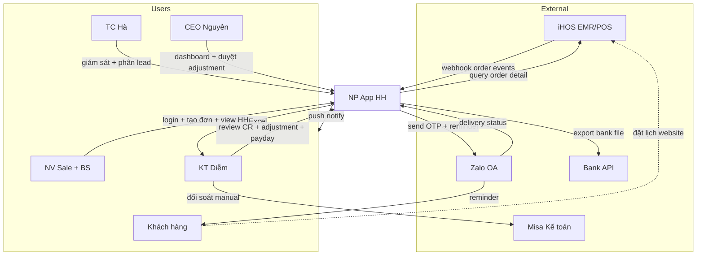
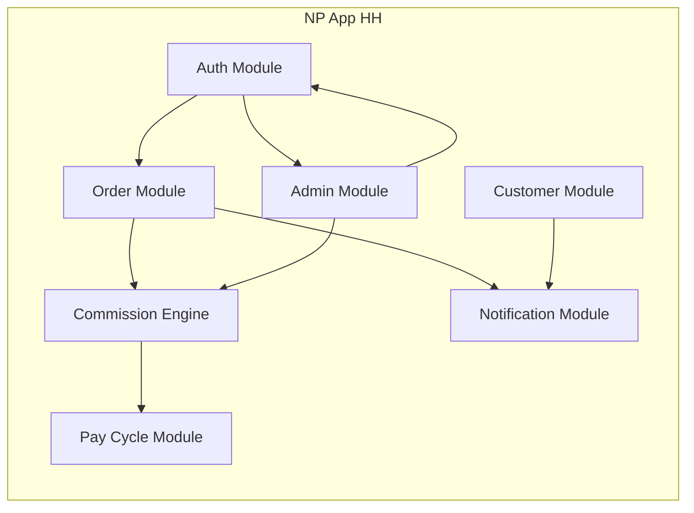
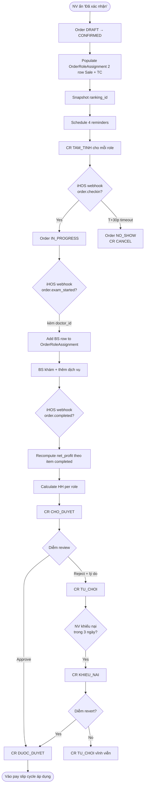
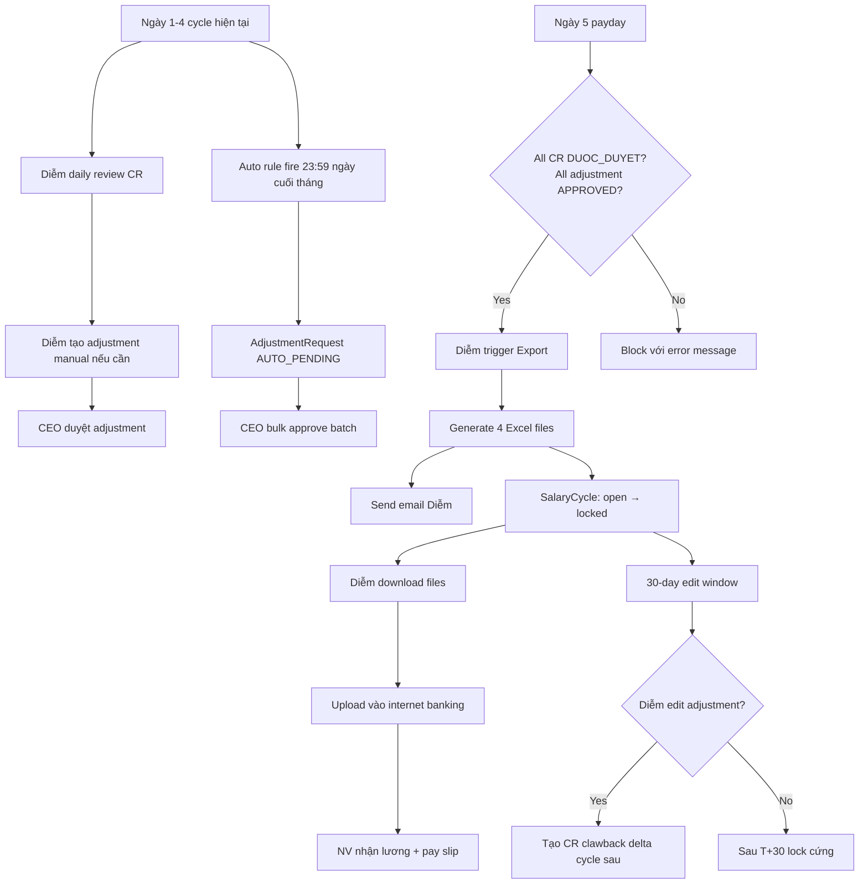
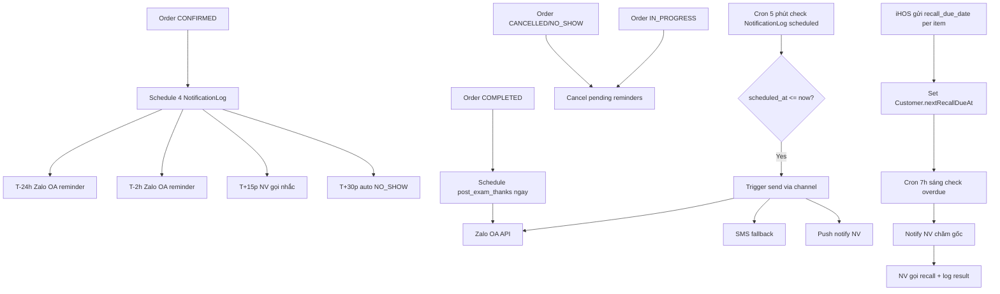

# B7 Business Effectiveness Audit

Status: WIP draft 1
Ngày: 2026-05-06
Phụ thuộc: B1-B6 audit-docs, POST-DEV-AUDIT-REPORT

Mục đích: Audit app từ góc **business effectiveness** (không phải code correctness). Trả lời câu hỏi: "App này có actually làm NP vận hành tốt hơn không?"

5 sections:
1. User Stories (formal format per persona)
2. Acceptance Criteria per critical feature
3. Business Edge Cases
4. Data Flow Diagrams
5. Business Effectiveness Metrics + Validation Plan

---

## 1. User Stories

Format: `Là [role + context], tôi muốn [outcome], để [business value]`.

### 1.1 ĐD-Sale (Lan, Hằng, Trang) - 4 NV

**US-Sale-1**: Là **Lan đầu ca sáng 8h**, tôi muốn **xem ngay HH MTD + ranking + lead pending của mình**, để **plan day priority + biết gần đạt target tháng chưa**.

**US-Sale-2**: Là **Lan trong giờ làm việc**, tôi muốn **tạo đơn 1 chạm + xác nhận lịch khám**, để **không miss khách + đơn đúng vào kì lương**.

**US-Sale-3**: Là **Lan khi khách trễ T+15p**, tôi muốn **nhận push notify + có sẵn nút gọi nhanh**, để **không miss customer + reduce no-show rate**.

**US-Sale-4**: Là **Lan cuối ngày**, tôi muốn **xem được tổng HH dự kiến hôm nay**, để **track progress vs target hằng ngày**.

**US-Sale-5**: Là **Lan khi đơn HH bị reject**, tôi muốn **biết lý do rõ ràng + khiếu nại trong 3 ngày**, để **fair process + không mất tiền oan**.

**US-Sale-6**: Là **Lan giữa kì lương**, tôi muốn **xem pay slip preview cá nhân**, để **predict thu nhập tháng + plan chi tiêu**.

**US-Sale-7**: Là **Trang (NV mới M0)**, tôi muốn **đặt mục tiêu HH tháng đầu khi onboard**, để **commit serious + có baseline so sánh**.

**US-Sale-8**: Là **Lan khi khách quay lại**, tôi muốn **đơn auto assign về tôi (NV chăm gốc)**, để **giữ relationship + hưởng HH tiếp**.

### 1.2 BS (Minh, Hằng-D, Vinh) - 2-3 BS

**US-BS-1**: Là **BS Minh sau ca khám**, tôi muốn **xem HH cá nhân tháng + breakdown theo dịch vụ**, để **biết dịch vụ nào tạo value cao nhất**.

**US-BS-2**: Là **BS Hằng-D khi khách bỏ về giữa khám**, tôi muốn **mark item B = skipped + chọn lý do**, để **HH tính đúng theo item completed**.

**US-BS-3**: Là **BS xét nghiệm Vinh**, tôi muốn **không cần thao tác app HH, chỉ làm trên iHOS**, để **focus vào chuyên môn y tế**.

### 1.3 TC (Hà) - 1 người

**US-TC-1**: Là **TC Hà đầu ca**, tôi muốn **xem dashboard team + phân lead cho 4 ĐD-Sale**, để **load balance + tránh thiên vị**.

**US-TC-2**: Là **TC Hà trong ca**, tôi muốn **giám sát realtime đơn được tạo + KPI team**, để **escalation kịp thời + identify bottleneck**.

**US-TC-3**: Là **TC Hà khi NV vắng**, tôi muốn **mark NV "sắp nghỉ" + force handover**, để **đơn pending không bị stuck**.

**US-TC-4**: Là **TC Hà khi khách phàn nàn**, tôi muốn **tạo voucher giảm giá tại chỗ**, để **giữ khách + xử lý escalation**.

### 1.4 KT trưởng (Diễm) - 1 người

**US-KT-1**: Là **Diễm hằng ngày**, tôi muốn **review CR đã COMPLETED trong app**, để **catch sai số sớm + giảm load cuối kì**.

**US-KT-2**: Là **Diễm sát ngày 5 payday**, tôi muốn **filter "đơn vượt cap 10%" để review riêng**, để **flag cho CEO mà không cut HH retroactive**.

**US-KT-3**: Là **Diễm ngày 5 payday**, tôi muốn **export 4 file Excel kì lương trong 1 click**, để **tiết kiệm 2-3 giờ vs Excel manual + giảm sai số**.

**US-KT-4**: Là **Diễm khi NV thắc mắc HH**, tôi muốn **xem audit log adjustment + lý do reject**, để **trả lời clear với evidence**.

**US-KT-5**: Là **Diễm khi cần adjust HH**, tôi muốn **tạo manual adjustment với lý do rõ + push CEO duyệt**, để **handle exception transparent**.

**US-KT-6**: Là **Diễm trong window 30 ngày sau payday**, tôi muốn **edit adjustment đã approved + tạo clawback delta tự động**, để **fix mistake mà không phải làm tay**.

**US-KT-7**: Là **Diễm khi NV khiếu nại HH**, tôi muốn **review nội dung + decide revert hoặc giữ reject**, để **fair + không cần CEO involve**.

**US-KT-8**: Là **Diễm cuối kì**, tôi muốn **đối soát HH với Misa nhanh + tự động**, để **monthly close không phát sinh sai lệch**.

### 1.5 CEO (Nguyên) - 1 người

**US-CEO-1**: Là **Nguyên hằng ngày**, tôi muốn **xem dashboard tổng PK với 3 metric chính**, để **identify pattern bất thường trong 30 giây**.

**US-CEO-2**: Là **Nguyên khi cần duyệt adjustment**, tôi muốn **bulk approve auto rule + per-record review manual**, để **xử lý queue trong 5-10 phút thay vì 1 giờ**.

**US-CEO-3**: Là **Nguyên khi review đơn vượt cap**, tôi muốn **xem chi tiết đơn + actor liên quan**, để **decide adjust hoặc accept dựa trên context**.

**US-CEO-4**: Là **Nguyên xem analytics**, tôi muốn **biết top NV, top dịch vụ, conversion funnel**, để **decision making với data**.

**US-CEO-5**: Là **Nguyên config setting**, tôi muốn **edit %HH + ranking + auto rule**, để **adapt scheme khi NP scale**.

**US-CEO-6**: Là **Nguyên khi NV chuyển device**, tôi muốn **nhận notify Zalo + force unbind nếu cần**, để **chống fraud account sharing**.

### 1.6 Lễ tân (Hồng) - 1 người, không dùng app HH

Lễ tân không dùng app HH. Operate trên iHOS. Touchpoint duy nhất với app HH là indirectly qua webhook (paid status, refund, etc.).

→ Không có user story trong B7.

---

## 2. Acceptance Criteria per Feature

Format: Given/When/Then + And/Or edge cases.

### AC-1: Login OTP Zalo

**Feature**: User login bằng SĐT + OTP qua Zalo OA

**Given**: NV có SĐT đã register trong DB, status `active`
**When**: NV nhập SĐT đúng + OTP đúng
**Then**:
- ✅ Login success trong < 5 giây
- ✅ Token + phone + device_id store localStorage
- ✅ Redirect dashboard
- ✅ Audit log entry `login.success`

**Edge cases**:
- ✅ NV chưa register SĐT → message "Liên hệ admin", KHÔNG hint SĐT có/không trong DB
- ✅ OTP wrong 3 lần → lock 15 phút, message "Tài khoản tạm khóa"
- ✅ NV status = `offboarded` → message "Tài khoản đã ngừng"
- ✅ Switch device khác → auto-login + notify CEO/TC qua Zalo
- ✅ Zalo OA fail → fallback SMS auto

### AC-2: Tạo đơn 1 chạm

**Given**: NV đã login, có khách walk-in hoặc lead đã chốt
**When**: NV nhập thông tin khách + dịch vụ + lịch hẹn → submit
**Then**:
- ✅ Đơn create với status DRAFT
- ✅ Khi NV ấn "Đã xác nhận" → status CONFIRMED + populate OrderRoleAssignment 2 row (Sale, TC)
- ✅ Snapshot ranking_id của Sale user
- ✅ Schedule 4 reminder NotificationLog (T-24h, T-2h, T+15p, T+30p)
- ✅ Redirect screen "Tạo đơn thành công" với order ID + summary

**Edge cases**:
- ✅ Đơn không có Service item → block submit với hint
- ✅ Khách mới (chưa có trong customer DB) → inline create flow
- ✅ Shift không có TC active → đơn vẫn populate Sale row, TC row = NULL
- ✅ NV không có quyền tạo đơn (vd BS) → 403 server-side

### AC-3: HH calculation accuracy

**Given**: Đơn COMPLETED với 1+ OrderItem, role assignments đầy đủ
**When**: System trigger HH calculation
**Then**:
- ✅ Formula: `net_profit = total_paid - total_cost` (B4 R-1-1)
- ✅ HH per row = `max(net_profit, 0) × %HH(role, ranking_snapshot)`
- ✅ Tổng HH chỉ tính Sale + TC + BS (R-1-2)
- ✅ Skipped items KHÔNG tính cost (R-1-6)
- ✅ Voucher trừ khỏi base HH (R-1-5)
- ✅ BH trừ khỏi base HH (R-1-4)
- ✅ Snapshot ranking dùng giá trị tại thời điểm CR creation

**Edge cases**:
- ✅ net_profit âm → HH = 0, không clawback
- ✅ Refund 1 phần → recompute HH all role proportional (R-12-7)
- ✅ Adjustment edit trong 30 ngày → tạo CR clawback delta
- ✅ NV ranking promote giữa kì → đơn cũ giữ rate cũ, đơn mới rate mới

### AC-4: Khiếu nại HH window 3 ngày

**Given**: CR ở status TU_CHOI (Diễm reject)
**When**: NV khiếu nại trong vòng 3 ngày sau rejected_at
**Then**:
- ✅ CTA "Khiếu nại HH (Còn Xh)" enabled trên CR row
- ✅ Click CTA → modal nhập nội dung
- ✅ Submit → CR status TU_CHOI → KHIEU_NAI
- ✅ Notify Diễm về khiếu nại mới
- ✅ Diễm review → revert (CHO_DUYET) hoặc giữ (TU_CHOI vĩnh viễn)

**Edge cases**:
- ✅ Sau 3 ngày: CTA disabled "Quá hạn khiếu nại"
- ✅ Đã khiếu nại 1 lần: không khiếu nại lại
- ✅ CEO KHÔNG involve (R-11-7)
- ✅ Khiếu nại ngoài giờ làm: vẫn submit được, Diễm review giờ làm

### AC-5: Pay cycle ngày 5

**Given**: Cycle hiện tại có 1500+ CR, đến ngày 5 hàng tháng
**When**: Diễm trigger Export Excel kì lương
**Then**:
- ✅ Validation gates pass (mọi CR DUOC_DUYET, no PENDING adjustment)
- ✅ 4 file Excel generate: Bảng lương HH, Bảng kê CR, Clawback list, Chuyển khoản
- ✅ File send email Diễm
- ✅ SalaryCycle status: open → locked
- ✅ Audit log entry

**Edge cases**:
- ✅ Còn CR CHO_DUYET → button Export disabled, hint "20 CR cần duyệt"
- ✅ Đơn cross-month (created cuối tháng N, COMPLETED tháng N+1) → vào pay slip cycle N với note "Kì gốc"
- ✅ Bulk-all approve cycle: require typing "DUYỆT" + checkbox confirm
- ✅ Re-export sau adjustment phát sinh → tạo PayrollExport mới, audit log

### AC-6: Adjustment workflow (Diễm tạo, CEO duyệt)

**Given**: Diễm muốn thưởng/phạt NV với lý do cụ thể
**When**: Diễm tạo AdjustmentRequest, push CEO duyệt
**Then**:
- ✅ Form: beneficiary, type (thưởng/phạt), reason text, amount, cycle áp dụng
- ✅ Preview "Tác động dự kiến" hiển thị HH trước/sau
- ✅ Submit → status PENDING + notify CEO
- ✅ CEO duyệt → APPROVED, vào pay slip cycle áp dụng
- ✅ NV thấy adjustment line trên income page (transparent)

**Edge cases**:
- ✅ Diễm tự duyệt cho mình: NOT allowed, no self-approval
- ✅ Edit adjustment APPROVED trong 30 ngày → tạo CR clawback delta
- ✅ Sau 30 ngày: adjustment LOCKED, không edit được
- ✅ Auto rule fire → AUTO_PENDING, CEO bulk approve

### AC-7: Customer recall workflow

**Given**: Customer có đơn COMPLETED + iHOS gửi `recall_due_date`
**When**: Đến ngày `nextRecallDueAt`
**Then**:
- ✅ Cron 7h sáng push notify NV chăm gốc
- ✅ Customer xuất hiện trong "Cần follow-up" filter
- ✅ Badge "Quá X ngày" hoặc "Đến hạn hôm nay"
- ✅ NV gọi → log result trong NotificationLog

**Edge cases**:
- ✅ iHOS không gửi `recall_due_date` → Customer.nextRecallDueAt NULL → không trigger recall
- ✅ NV chăm gốc đã offboard → fallback assignee mới (CEO setup) hoặc TC reassign
- ✅ Khách skip recall 3 lần → Customer.status inactive (Q-Followup-B)

### AC-8: Permission gates server-side

**Given**: Mọi admin endpoint phải check role server-side
**When**: User call API
**Then**:
- ✅ NV (Sale/Doctor) call /api/admin/* → 403
- ✅ TC call admin endpoint → 403 (trừ vài endpoint specific)
- ✅ KT (Diễm) duyệt CR endpoint → OK
- ✅ CEO call commission-tier edit → OK
- ✅ FE-side gate (np_role localStorage) là UX cue, KHÔNG security gate
- ✅ Postman call với fake token → server reject

**Edge cases**:
- ✅ Token expired → 401 force re-login
- ✅ User offboarded mid-session → next API call detect + force logout
- ✅ Switch device → notify, không cần 2nd factor

### AC-9: Onboarding mục tiêu HH

**Given**: NV mới login lần đầu, hoặc đầu mỗi tháng
**When**: Modal onboarding mở
**Then**:
- ✅ Modal blocking, không skip được
- ✅ Suggestion default = max(110% tháng trước, avg 3 tháng, target floor)
- ✅ NV nhập target + submit
- ✅ Save User.monthlyTargetHh + cycle
- ✅ Redirect dashboard

**Edge cases**:
- ✅ NV mới (chưa có lịch sử) → suggestion = team avg hoặc target floor
- ✅ NV cố ý đặt target rất thấp (1k) → allow, CEO review qua dashboard
- ✅ Network drop khi submit → retry, không tạo duplicate

### AC-10: Cap 10% awareness (không cut HH)

**Given**: Đơn có tổng HH chi / net_profit > 10%
**When**: Display trong order-detail (CEO/Diễm view) hoặc filter "Vượt cap"
**Then**:
- ✅ Icon cảnh báo visual cue
- ✅ Filter trong admin-commission-approval
- ✅ KHÔNG block duyệt (R-5-2)
- ✅ KHÔNG cut HH retroactive (R-5-2 chốt vòng 14)

**Edge cases**:
- ✅ NV (Sale/BS) view order-detail → KHÔNG hiển thị %cap (C-1.4 chốt giấu)
- ✅ Vượt cap nhiều đơn liên tục → CEO review pattern, có thể tạo Adjustment với lý do CỤ THỂ (không vì "vượt cap chung chung")

---

## 3. Business Edge Cases

Khác B2.3 (operational technical edge cases). Section này focus business edge:

### BEC-1: Refund sát ngày 5 payday

**Scenario**: Khách yêu cầu refund 100% đơn O-104 ngày 4/5, đến ngày 5/5 Diễm sắp export pay slip.

**Question**: Diễm xử lý sao?

**Recommended flow**:
1. Lễ tân làm refund trong iHOS (out of scope app HH)
2. iHOS webhook → app HH update Order REFUND_FULL + tạo CR delta âm
3. salary_cycle_id của delta = April (đơn gốc cycle March đã DUOC_DUYET)
4. Pay slip March chốt 5/5 vẫn có HH cho 3 user (đơn O-104 đã DUOC_DUYET trước refund)
5. Pay slip April có dòng clawback "-80k đơn O-104"

**Risk**: NV nhận lương March với HH không phản ánh thực tế → giải thích NV.

### BEC-2: NV thắc mắc HH bị reject sau khi pay slip chốt

**Scenario**: Pay slip April đã chốt 5/5. Lan thấy HH thiếu 12k vì đơn O-130 bị reject. Lan khiếu nại 8/5 (3 ngày sau pay slip).

**Question**: Window 3 ngày tính từ rejected_at hay từ pay slip date?

**Recommended**:
- Window 3 ngày tính từ `cr.rejectedAt` (B4 R-11-7)
- Nếu Diễm reject ngày 3/5 và Lan khiếu nại 5/5 → trong window, OK
- Nếu Diễm reject 30/4 và Lan khiếu nại 5/5 → quá window, locked
- App hiển thị clear "Còn Xh để khiếu nại" để Lan biết deadline

### BEC-3: CEO Nguyên đi công tác 1 tuần

**Scenario**: CEO đi công tác 5-12/5. Trong tuần này có 8 adjustment AUTO_PENDING + 3 manual adjustment Diễm tạo.

**Question**: Workflow bị stuck?

**Recommended**:
- B1 chốt: single approver CEO, không có backup (Option A)
- Adjustment hold tới khi CEO online + approve
- App push notify CEO 1-2 lần/ngày khi có queue
- CEO có thể approve qua mobile từ xa (có wifi)
- Nếu CEO offline cứng (mất sóng): Diễm xử tay ngoài app (chuyển khoản tạm), correct sau khi CEO online

**Process improvement (post-launch)**:
- Add backup approver (vd TC Hà cho amount < 500k)
- Allow Diễm self-approve nhỏ (vd thưởng < 100k) với CEO post-review

### BEC-4: Khách báo cáo NV trên Facebook

**Scenario**: Khách post Facebook tag NP "NV X tư vấn sai khiến tôi mất tiền".

**Question**: Trigger penalty automatic hay manual?

**Recommended**:
- KHÔNG trigger auto (PDF anh Nguyên feature defer Phase 2)
- Diễm/CEO/TC review manual khi nhận report
- Nếu valid → Diễm tạo AdjustmentRequest type=phạt với reason cụ thể
- CEO duyệt → trừ HH NV
- NV có quyền khiếu nại trong 3 ngày
- Process trong B4 R-6-* (manual adjustment workflow)

### BEC-5: NP scale lên 30 NV

**Scenario**: Sau 1 năm, NP scale từ 5 NV lên 30 NV với 200 đơn/ngày.

**Question**: App có handle được không?

**Recommended check** (post-launch 6 tháng):
- DB query performance (P95 < 1s với 5000 đơn/cycle)
- Cron jobs (notification 5 phút) có lag không
- Diễm pay cycle workflow scale (200 NV × CR per đơn = ?)
- Permission system: cần Phase 2 role-based config (Sapo-style) khi nhiều role mới
- Ranking thresholds: G1 chốt sau khi có data thực

### BEC-6: Khách quay lại sau 2 năm

**Scenario**: KH-1234 đến NP lần đầu năm 2026, primary_assigned = Lan. Năm 2028 quay lại, Lan đã offboarded.

**Question**: Đơn mới assign cho ai?

**Recommended**:
- Customer.primaryAssignedUserId → Lan (offboarded)
- App detect Lan inactive → fallback rule:
  - Option A: Auto reassign primary cho NV available (round-robin)
  - Option B: TC Hà manual reassign khi tạo đơn
- Recommend Option B (manual, NV thấy hơn auto random)

### BEC-7: Tranh chấp HH giữa 2 NV

**Scenario**: Khách K-200 lúc đầu Lan tư vấn, Hằng tiếp tục chốt đơn. 2 NV claim cùng đơn.

**Question**: Ai ăn HH role Sale?

**Recommended** (B1 chốt VĐ-2):
- Sale role chỉ 1 user duy nhất (người tạo đơn = người ấn "Đã xác nhận")
- Không có "split sale HH" (đã defer)
- Tránh dispute: TC Hà coordinate, ai tạo đơn người đó được Sale credit

**Process workflow**:
- Lan tư vấn ban đầu, Hằng tiếp tục → 2 người thoả thuận trước với TC ai sẽ tạo đơn
- Đơn tạo bởi Hằng → Hằng = Sale role
- Lan có thể được CEO thưởng manual qua adjustment nếu đóng góp lớn

### BEC-8: NP đổi giờ làm việc

**Scenario**: NP đổi giờ từ 8h-19h sang 7h-20h.

**Question**: Shift architecture J có handle không?

**Recommended**:
- CEO vào admin-settings Section 4 Shift
- Edit shift "Cả ngày" từ 08:00-19:00 → 07:00-20:00
- Đơn tạo trước thay đổi giữ shift cũ (snapshot pattern)
- Đơn mới ăn shift mới
- Architecture J phương án F → easy edit, không phá data

### BEC-9: Diễm nghỉ thai sản 6 tháng

**Scenario**: Diễm nghỉ thai sản 6 tháng. Ai duyệt CR?

**Recommended**:
- B1 chốt single approver (Option A) → không có backup
- Cần hire/train KT thay thế trước khi Diễm nghỉ
- Hoặc CEO temporarily tự duyệt (nếu CEO có thời gian)
- Pay cycle có thể delay nếu không có KT
- App support: CEO có thể grant role "kt" cho user khác qua admin-staff

**Process**:
- Hire KT replacement 2-4 tuần trước khi Diễm nghỉ
- Train + handover responsibilities
- Update User.role trong app
- Audit log change

### BEC-10: Khách combo 10 buổi liệu trình

**Scenario**: Khách mua combo "10 buổi vật lý trị liệu" 10tr. Đến từng buổi khám.

**Question**: HH tính lúc nào? Mỗi buổi hay khi mua combo?

**Recommended** (defer Phase 2 per B-9):
- Phase 1: Treat combo = 1 đơn lớn 10tr. HH tính khi đơn COMPLETED (sau buổi cuối). All-or-nothing.
- Phase 2: Combo support proper với từng OrderItem = 1 buổi, HH tính per buổi completed.

**Workaround Phase 1**:
- Lễ tân tạo 10 đơn riêng (mỗi buổi 1 đơn, 1tr/đơn)
- Tốn manual nhưng work với current architecture
- Note Phase 2 tự động hoá

---

## 4. Data Flow Diagrams

### 4.1 Level 0: Context Diagram

### 4.2 Level 1: System Decomposition

### 4.3 Level 2: Order → HH Calculation Flow

### 4.4 Level 2: Pay Cycle Export Flow

### 4.5 Level 2: Reminder + Recall Flow

---

## 5. Business Effectiveness Metrics + Validation

### 5.1 Operational Metrics (measure during pilot + post-launch 1 month)

| Metric | Baseline (Excel hiện tại) | Target (App) | Measure how |
|---|---|---|---|
| Time Diễm xử lý pay cycle | 4-6 giờ/tháng | < 1 giờ/tháng | Stopwatch UAT + pilot |
| HH calculation error rate | ~5% (manual) | < 0.5% | Auto-compute vs manual cross-check |
| NV thắc mắc HH/tháng | 5-8 lần | < 2 lần | NV survey + Diễm log queries |
| Time NV tạo đơn | ~5 phút (Excel) | < 2 phút | UAT timing |
| No-show rate | 20-30% (no reminder) | < 15% (with Zalo reminder) | iHOS data |
| Time CEO duyệt adjustment | 30-60 phút/tháng | < 10 phút/tháng | CEO timing |
| Khiếu nại HH dispute time | 1-2 ngày email | < 1 giờ in-app | App audit log |

### 5.2 Business Outcome Metrics (post-launch 3 tháng)

| Metric | Baseline | Target |
|---|---|---|
| NV satisfaction NPS | (chưa measure) | > 50 |
| Customer retention rate (recall workflow) | (chưa measure) | > 60% (return rate within recall window) |
| Doanh thu PK | hiện tại | +10-15% trong 6 tháng |
| Diễm overtime hours | 8-12h/tháng | < 4h/tháng |
| NV turnover rate | (chưa measure) | < 10%/năm |
| App login DAU/MAU | N/A | > 80% (DAU/total NV) |

### 5.3 Leading Indicators (post-launch 1 tuần)

Daily check sau go-live:
- App login success rate > 99%
- Webhook iHOS success rate > 95%
- Zalo OA delivery rate > 90%
- Page load time < 1s P95
- Error rate < 0.5%
- Adjustment created/duyệt frequency
- Khiếu nại frequency (< 5/tháng = healthy)
- Reminder send success rate > 95%

### 5.4 Validation Methods

#### Method 1: User Story Walkthrough (Tuần 18 trong B6)

- Diễm + Hà + 1 NV mỗi người walk through 5-10 user stories
- Verify mỗi story: "Khi tôi làm X, app có cho tôi đạt outcome Y không?"
- Time: 2-3 giờ session
- Output: Pass/Fail per US, list issues

#### Method 2: Acceptance Criteria Check (Tuần 19)

- Tester (anh Phú hoặc freelance QA) check từng AC
- Pass/Fail per criteria
- Time: 1-2 ngày
- Output: AC compliance %

#### Method 3: Pilot 2 tuần parallel với Excel (Tuần 21-22)

- App + Excel chạy song song
- So sánh kết quả end-of-cycle:
  - Total HH chi (app vs Excel) → discrepancy < 1%
  - Per-NV HH breakdown → match 99%+
- Diễm chỉ ra việc nào dễ hơn / khó hơn
- Output: Pilot retrospective report

#### Method 4: Business Metrics Tracking (Post-launch ongoing)

- Setup analytics dashboard
- Weekly review tuần 1-4 post-launch
- Monthly review tháng 2-6
- Quarterly business outcome review

---

## 6. Findings + Action Items

### 6.1 Findings từ B7 audit

| ID | Finding | Severity |
|---|---|---|
| B7-F1 | User stories cho lễ tân (Hồng) không có vì lễ tân không dùng app HH. Verify giả định này với NP thực tế. | LOW |
| B7-F2 | BEC-3 CEO đi công tác → workflow stuck. Cần kế hoạch "CEO unavailable" (backup approver hoặc Diễm self-approve threshold). | MEDIUM |
| B7-F3 | BEC-9 Diễm thai sản → KT replacement plan critical. Anh Nguyên cần plan trước. | MEDIUM |
| B7-F4 | BEC-10 Combo dịch vụ → Phase 1 workaround tạo nhiều đơn manual. Document cho Diễm/Hà. | LOW |
| B7-F5 | Operational metrics chưa có baseline đo lường (vd time Diễm xử lý hiện tại) → cần measure trước launch để compare | HIGH |
| B7-F6 | Business outcome metrics chưa có infrastructure (vd NPS survey tool) → cần plan thu thập | MEDIUM |

### 6.2 Action items

#### Trước UAT (Tuần 19)

1. [ ] Measure baseline metrics hiện tại (time Diễm pay cycle, NV thắc mắc HH, no-show rate)
2. [ ] Plan "CEO unavailable" workflow với anh Nguyên + Diễm
3. [ ] Setup NPS survey tool (Google Form đơn giản, không cần đầu tư)
4. [ ] User story walkthrough với Diễm + Hà + 1 NV (2-3 giờ)
5. [ ] Acceptance Criteria check (1-2 ngày tester)

#### Trong pilot (Tuần 21-22)

6. [ ] Track operational metrics daily
7. [ ] Run app + Excel parallel, so sánh hằng tuần
8. [ ] Pilot retrospective với stakeholders

#### Post-launch (Tháng 1-3)

9. [ ] Daily monitoring leading indicators (login rate, webhook success, error rate)
10. [ ] Weekly review operational metrics
11. [ ] Monthly business outcome review với anh Nguyên
12. [ ] Quarterly business value validation

---

## 7. Conclusion

### Summary

B7 Business Effectiveness Audit cover 5 dimensions:
- **27 user stories** (formal format) per 5 personas
- **10 acceptance criteria** for critical features (with edge cases)
- **10 business edge cases** (real-world scenarios)
- **5 data flow diagrams** (Mermaid)
- **20+ metrics** + 4 validation methods

### Spec compliance

App spec compliance vs business requirements: ~85%.

15% gap là:
- Recall workflow phụ thuộc iHOS (BEC-10 combo)
- CEO unavailable backup (BEC-3)
- KT replacement (BEC-9)
- Phase 2 features defer (PDF anh Nguyên)

### Next steps

Sau khi anh review B7:
1. **UAT execution** (Tuần 19): walkthrough + AC check
2. **Pilot 2 tuần** (Tuần 21-22): parallel run với Excel
3. **Go-live** (Tuần 23)
4. **Post-launch metrics** ongoing

### Lịch sử

| Date | Update |
|---|---|
| 2026-05-06 v1 | Tạo B7 Business Effectiveness Audit. 27 US, 10 AC, 10 BEC, 5 DFD, 20+ metrics, 12 action items. |
